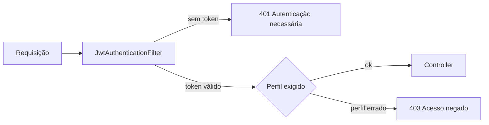

# 🐾 Animed API

> **API REST de cuidado contínuo e gamificação para pets** - Challenge FIAP 2026

Sistema backend que materializa a proposta da **Animed**: transformar a jornada de saúde do pet de um modelo *episódico e reativo* em uma experiência **contínua, preventiva e gamificada**, conectando tutores, clínicas e pet shops parceiros num ecossistema único.

---

## 📋 Sumário

- [Visão Geral](#-visão-geral)
- [Diferencial — Sistema de Gamificação](#-diferencial--sistema-de-gamificação)
- [Stack Tecnológica](#️-stack-tecnológica)
- [Arquitetura](#-arquitetura)
- [Modelo de Domínio](#-modelo-de-domínio)
- [Como Executar](#-como-executar)
- [Documentação das Rotas](#-documentação-das-rotas)
- [Segurança e perfis](#-segurança-e-perfis)
- [Testes](#-testes)
- [Equipe](#-equipe)

---

## 🎯 Visão Geral

A **Animed API** resolve um problema crítico do mercado pet brasileiro: a **descontinuidade do cuidado**. Hoje, tutores só interagem com o ecossistema veterinário em momentos pontuais (vacinas, emergências), o que gera:

- ❌ Pior cuidado preventivo
- ❌ Menor LTV para clínicas
- ❌ Baixa fidelização
- ❌ Histórico clínico fragmentado

### Nossa Solução

Uma **plataforma gamificada** onde cada ação de cuidado vira pontos, descontos e benefícios — alinhando interesses de tutores, clínicas e pet shops.

### Benefícios para o Negócio

| Stakeholder | Benefício |
|-------------|-----------|
| **Tutor** | Cuidado preventivo recompensado, descontos progressivos, organização da saúde do pet |
| **Pet** | Maior frequência de check-ups, vacinas em dia, qualidade de vida |
| **Clínicas** | Recorrência, fidelização, maior LTV, base de dados longitudinal |
| **Pet Shops** | Mais vendas via tráfego qualificado, modelo de baixo risco (taxa+comissão) |
| **Animed** | Comissão sobre vendas + assinatura mensal de parceiros + plano premium do usuário |

---

## 🎮 Diferencial — Sistema de Gamificação

### Como o tutor ganha pontos

| Ação | Pontos | Quem registra |
|------|-------:|---------------|
| Cadastrar o primeiro pet | 50 | tutor |
| Perfil completo do pet | 50 | tutor |
| Foto do primeiro pet | 15 | tutor |
| Dose de medicamento | 15 | tutor |
| Atualização de peso | 5 | tutor |
| Agendar atendimento | 10 | tutor |
| Compra em parceiro | 1 ponto / R$ 10 | tutor |
| Vacina aplicada | 25 | **veterinário** |
| Consulta realizada | 20 | **veterinário** |
| Check-up concluído | 30 | **veterinário** |

### Sistema de Níveis

| Nível | Pontos | Desconto | Moedas |
|-------|--------|---------:|--------|
| 🥉 **Básico** | 0 – 299 | 0% | bloqueadas |
| 🥈 **Cuidador** | 300 – 1.199 | 10% | bloqueadas |
| 🥇 **Tutor Premium** | 1.200+ | 15% | **liberadas** |

Cada crédito de pontos gera também **moedas**, um saldo gastável a dez centavos por unidade. Elas só são liberadas no Tutor Premium e abatem no máximo metade do valor de uma compra.

### Como funciona o desconto na prática

```
Produto: Ração Premium R$ 219,90

Tutor BÁSICO    → paga R$ 219,90   (0% de desconto)
Tutor CUIDADOR  → paga R$ 197,91   (10%)  → comissão de 5% = R$ 9,90
Tutor PREMIUM   → paga R$ 186,92   (15%)  → comissão de 5% = R$ 9,35
Tutor PREMIUM   → paga R$ 149,54   (15% + 374 moedas)
```

### Como a economia se defende

Uma gamificação ingênua vira fonte infinita de pontos. As travas implementadas:

| Brecha | Trava | Onde |
|--------|-------|------|
| Cadastrar vários pets para repetir o bônus | Só o primeiro pet pontua; limite de 5 | `PetService` |
| Trocar a foto sem parar | Uma vez, e só no primeiro pet | `PetService.registrarFoto` |
| Digitar peso repetidamente | Um crédito a cada 7 dias, por pet | `PetService.registrarPeso` |
| Registrar dose em série | Só pontua respeitando o intervalo da receita | `MedicamentoService` |
| Marcar horário só para pontuar | Falta estorna; cancelamento custa 30 pontos | `AgendaService` |
| Gastar moedas zerando a compra | Abatimento limitado a metade do valor | `TransacaoParceiroService` |

O registro sempre acontece — o histórico clínico precisa refletir a realidade. O que as regras limitam é o **crédito**.

---

## 🛠️ Stack Tecnológica

- **Java 17**
- **Spring Boot 3.3.4**
  - Spring Web (REST)
  - Spring Data JPA
  - Spring Validation (Bean Validation)
  - Spring Cache (Caffeine)
  - Spring HATEOAS (Nível 3 de Maturidade Richardson)
- **Oracle Database** (produção FIAP) + **H2** (dev local)
- **Flyway** (migrations versionadas)
- **Lombok**
- **SpringDoc OpenAPI 3** (Swagger UI)
- **Maven**

---

## 🏗️ Arquitetura

```
┌─────────────────┐
│   Controller    │  ← REST endpoints, Swagger, HATEOAS
└────────┬────────┘
         │
┌────────▼────────┐
│     Service     │  ← Regra de negócio, gamificação, cache
└────────┬────────┘
         │
┌────────▼────────┐
│   Repository    │  ← Spring Data JPA + JPQL
└────────┬────────┘
         │
┌────────▼────────┐
│   Entity (JPA)  │  ← Modelo de domínio mapeado
└────────┬────────┘
         │
┌────────▼────────┐
│  Oracle / H2    │
└─────────────────┘
```

### Padrões aplicados

- **DTO Pattern** — separação entre modelo de domínio e API
- **Builder Pattern** (via Lombok) — construção fluente de entidades
- **Repository Pattern** — abstração de persistência
- **Dependency Injection** — via construtor (`@RequiredArgsConstructor`)
- **Global Exception Handler** — padronização de erros

---

## 📊 Modelo de Domínio

### Entidades principais

| Entidade | Descrição |
|----------|-----------|
| `Tutor` | Responsável pelo pet, possui pontos e nível de gamificação |
| `Pet` | Animal cadastrado (Cachorro, Gato, etc.) com histórico clínico |
| `Vacina` | Registro de vacinação aplicada no pet |
| `Consulta` | Agendamento/registro de consulta veterinária |
| `PetShop` | Parceiro B2B (taxa mensal + comissão por venda) |
| `TransacaoParceiro` | Compra realizada por tutor em pet shop |
| `HistoricoPontuacao` | Auditoria de todas as ações que renderam pontos, com estornos |
| `Usuario` | Credencial de acesso, com perfil TUTOR ou DOUTOR |
| `Medicamento` | Prescrição do veterinário: remédio, intervalo e duração |
| `DoseMedicamento` | Dose efetivamente administrada pelo tutor |

### Relacionamentos

```
Tutor    (1) ──── (N) Pet
Tutor    (1) ──── (N) HistoricoPontuacao
Tutor    (1) ──── (N) TransacaoParceiro
Usuario  (N) ──── (1) Tutor            credencial do tutor
Pet      (1) ──── (N) Vacina
Pet      (1) ──── (N) Consulta
Pet      (1) ──── (N) Medicamento
Medicamento (1) ─ (N) DoseMedicamento
Consulta (N) ──── (1) Usuario          veterinário responsável
PetShop  (1) ──── (N) TransacaoParceiro
PetShop  (1) ──── (N) Consulta
```

> 📎 **Schema completo para executar:** [`docs/schema-completo.sql`](docs/schema-completo.sql)
> 📎 **Referência das tabelas, tipos e armadilhas:** [`docs/BANCO-DE-DADOS.md`](docs/BANCO-DE-DADOS.md)
> 📎 Diagrama de classes detalhado em `docs/DIAGRAMA_CLASSES.md`
> 📎 Diagrama Entidade-Relacionamento em `docs/DER.png` (gerado pela equipe de Database no Oracle Data Modeler)

---

## 🚀 Como Executar

### Pré-requisitos

- Java 17+
- Maven 3.8+
- Oracle XE rodando localmente **OU** banco da FIAP (`oracle.fiap.com.br:1521:ORCL`)

### Passo 1 — Clonar o repositório

```bash
git clone https://github.com/<usuario>/animed-api.git
cd animed-api
```

### Passo 2 — Configurar credenciais (Oracle FIAP)

Edite `src/main/resources/application-oracle.properties`:

```properties
spring.datasource.username=RMxxxxxx       # seu RM
spring.datasource.password=xxxxxx         # geralmente o RM sem letras
spring.jpa.properties.hibernate.default_schema=RMxxxxxx
```

### Passo 3 — Rodar com Oracle (default)

```bash
./mvnw spring-boot:run
```

### Passo 3 (alternativa) — Rodar com H2 (testes locais rápidos)

```bash
./mvnw spring-boot:run -Dspring-boot.run.profiles=h2
```

H2 Console: http://localhost:8080/h2-console

### Passo 4 — Acessar a documentação Swagger

🔗 **http://localhost:8080/swagger-ui.html**

---

## 📡 Documentação das Rotas

### 🧑 Tutores (`/api/tutores`)

| Método | Rota | Descrição |
|--------|------|-----------|
| `POST` | `/api/tutores` | Criar tutor |
| `GET` | `/api/tutores/{id}` | Buscar por ID (com HATEOAS) |
| `GET` | `/api/tutores` | Listar (paginado, ordenável) |
| `GET` | `/api/tutores/buscar?nome=` | Buscar por nome (LIKE) |
| `GET` | `/api/tutores/por-nivel/{nivel}` | Filtrar por nível de gamificação |
| `GET` | `/api/tutores/ranking` | Ranking de pontuação |
| `PUT` | `/api/tutores/{id}` | Atualizar |
| `DELETE` | `/api/tutores/{id}` | Deletar |

### 🐶 Pets (`/api/pets`)

| Método | Rota | Descrição |
|--------|------|-----------|
| `POST` | `/api/pets` | Cadastrar pet (gera pontos automáticos) |
| `GET` | `/api/pets/{id}` | Buscar por ID |
| `GET` | `/api/pets` | Listar |
| `GET` | `/api/pets/por-tutor/{idTutor}` | Pets de um tutor |
| `GET` | `/api/pets/por-especie/{especie}` | Filtrar por espécie |
| `GET` | `/api/pets/buscar?nome=` | Buscar por nome |
| `PUT` | `/api/pets/{id}` | Atualizar |
| `DELETE` | `/api/pets/{id}` | Deletar |

### 💉 Vacinas (`/api/vacinas`)

| Método | Rota | Descrição |
|--------|------|-----------|
| `POST` | `/api/vacinas` | Registrar vacinação (+30 pontos) |
| `GET` | `/api/vacinas/{id}` | Buscar por ID |
| `GET` | `/api/vacinas` | Listar |
| `GET` | `/api/vacinas/por-pet/{idPet}` | Vacinas de um pet |
| `GET` | `/api/vacinas/por-tutor/{idTutor}` | Vacinas de todos pets de um tutor |
| `PUT` | `/api/vacinas/{id}` | Atualizar |
| `DELETE` | `/api/vacinas/{id}` | Deletar |

### 🩺 Consultas (`/api/consultas`)

| Método | Rota | Descrição |
|--------|------|-----------|
| `POST` | `/api/consultas` | Agendar consulta |
| `GET` | `/api/consultas/{id}` | Buscar por ID |
| `GET` | `/api/consultas` | Listar |
| `GET` | `/api/consultas/por-pet/{idPet}` | Consultas de um pet |
| `GET` | `/api/consultas/por-tutor/{idTutor}` | Consultas de um tutor |
| `GET` | `/api/consultas/por-status/{status}` | Filtrar por status |
| `PUT` | `/api/consultas/{id}` | Atualizar (REALIZADA dispara +60 pontos) |
| `DELETE` | `/api/consultas/{id}` | Deletar |

### 🏪 Pet Shops (`/api/petshops`)

| Método | Rota | Descrição |
|--------|------|-----------|
| `POST` | `/api/petshops` | Cadastrar parceiro |
| `GET` | `/api/petshops/{id}` | Buscar por ID |
| `GET` | `/api/petshops` | Listar |
| `GET` | `/api/petshops/ativos` | Apenas ativos |
| `GET` | `/api/petshops/por-localizacao?cidade=&uf=` | Por cidade/UF |
| `GET` | `/api/petshops/buscar?nome=` | Por nome fantasia |
| `PUT` | `/api/petshops/{id}` | Atualizar |
| `DELETE` | `/api/petshops/{id}` | Deletar |

### 💳 Transações (`/api/transacoes`)

| Método | Rota | Descrição |
|--------|------|-----------|
| `POST` | `/api/transacoes` | Registrar compra (aplica desconto auto) |
| `GET` | `/api/transacoes/{id}` | Buscar por ID |
| `GET` | `/api/transacoes` | Listar |
| `GET` | `/api/transacoes/por-tutor/{idTutor}` | Transações de um tutor |
| `GET` | `/api/transacoes/por-petshop/{idPetShop}` | Transações de um pet shop |
| `GET` | `/api/transacoes/relatorios/comissao-petshop/{id}` | Total de comissão |
| `GET` | `/api/transacoes/relatorios/gasto-tutor/{id}` | Total gasto |
| `DELETE` | `/api/transacoes/{id}` | Estornar |

### 🔐 Autenticação (`/api/auth`)

| Método | Rota | Descrição | Perfil |
|--------|------|-----------|--------|
| POST | `/registrar` | Cria conta de tutor e o registro em `TB_TUTOR` | público |
| POST | `/login` | Devolve o token JWT e os dados da sessão | público |
| PATCH | `/senha` | Troca a própria senha, exigindo a atual | autenticado |

### 📅 Agenda (`/api/agenda`)

| Método | Rota | Descrição | Perfil |
|--------|------|-----------|--------|
| GET | `/disponibilidade?data=` | Horários livres do dia, já sem os ocupados | ambos |
| GET | `/disponibilidade/mes?ano=&mes=` | Dias do mês com vaga, para o calendário | ambos |
| GET | `/dia?data=` | Agenda do veterinário, com os atendimentos | ambos |
| GET | `/atendimentos/{id}` | Detalhe: profissional, endereço, orientação | ambos |
| POST | `/agendamentos` | Marca o horário e credita os pontos | tutor |
| PATCH | `/atendimentos/{id}/cancelar` | Libera o horário e estorna 30 pontos | tutor |
| PATCH | `/atendimentos/{id}/concluir` | Fecha o atendimento, com diagnóstico e retorno | **doutor** |
| PATCH | `/atendimentos/{id}/falta` | Não comparecimento: estorna os pontos | **doutor** |

### 💊 Medicamentos (`/api/medicamentos`)

| Método | Rota | Descrição | Perfil |
|--------|------|-----------|--------|
| POST | `/` | Prescreve: remédio, intervalo e duração | **doutor** |
| GET | `/por-pet/{idPet}` | Receitas do pet, com atraso e próxima dose | ambos |
| POST | `/{id}/doses` | Registra a dose dada; pontua se no horário | tutor |
| PATCH | `/{id}/concluir` | Tutor confirma o fim do tratamento | tutor |
| DELETE | `/{id}` | Encerra o tratamento hoje | **doutor** |

### 🧴 Cuidados (`/api/cuidados`)

| Método | Rota | Descrição | Perfil |
|--------|------|-----------|--------|
| POST | `/` | Registra pesagem e demais cuidados do dia a dia | tutor |

### 📜 Histórico (`/api/historico-pontuacao`)

| Método | Rota | Descrição |
|--------|------|-----------|
| `GET` | `/api/historico-pontuacao` | Listar todo histórico |
| `GET` | `/api/historico-pontuacao/por-tutor/{id}` | Por tutor |
| `GET` | `/api/historico-pontuacao/por-tipo/{tipo}` | Por tipo de ação |

---

## 🔒 Segurança e perfis

A API usa **Spring Security com JWT**, sem sessão no servidor. O token carrega o perfil, e as rotas são separadas por ele.



Há atos que **só o veterinário pratica**, e isso não é preferência de produto: a Resolução CFMV nº 1.321/2020 define a vacinação como ato privativo do médico-veterinário. O mesmo raciocínio vale para prescrever medicamento e concluir atendimento.

| Ação | TUTOR | DOUTOR |
|------|:-----:|:------:|
| Cadastrar e editar os próprios pets | ✅ | ✅ |
| Registrar cuidado do dia a dia e dose | ✅ | — |
| Marcar e cancelar atendimento | ✅ | — |
| Aplicar vacina | **403** | ✅ |
| Prescrever medicamento | **403** | ✅ |
| Concluir atendimento e registrar falta | **403** | ✅ |
| Cadastrar tutores e pet shops | **403** | ✅ |

### Contas de demonstração

Criadas por `SeedUsuariosConfig` quando `animed.seed-usuarios=true`. As senhas são geradas com BCrypt em tempo de execução — nenhum hash fica versionado.

| Perfil | E-mail | Senha |
|--------|--------|-------|
| Tutor | `tutor@animed.com.br` | `animed123` |
| Veterinária | `doutor@animed.com.br` | `animed123` |

---

## 🧪 Testes

```bash
./mvnw test
```

São **12 testes**, concentrados nas regras que dependem do relógio e que seriam inviáveis de conferir à mão:

| Classe | O que verifica |
|--------|----------------|
| `MedicamentoServiceTest` | Dose no horário, dentro da tolerância de 20 min, adiantada e pulada — e que a dose é sempre gravada, pontuando ou não |
| `AgendaServiceTest` | Falta estorna os pontos; não pode ser registrada antes da hora, sobre atendimento já realizado nem duas vezes |

---

## ✅ Requisitos Atendidos (Rubrica FIAP)

| Requisito | Status | Onde encontrar |
|-----------|--------|----------------|
| Spring Boot + JPA | ✅ | `pom.xml`, todas as entidades |
| Entidades com relacionamentos | ✅ | `entity/` (10 entidades) |
| POO + Coesão + Desacoplamento | ✅ | Service/Controller/Repository separados |
| API RESTful (Richardson nível 3) | ✅ | `TutorController` com HATEOAS |
| Padrões de projeto | ✅ | Builder, DTO, Repository, Singleton |
| JPQL + Query Methods | ✅ | `TutorRepository`, `VacinaRepository`, etc. |
| Bean Validation | ✅ | Todos os DTOs `Request` |
| Paginação | ✅ | Todos endpoints de listagem |
| Ordenação | ✅ | `Pageable` com `sort=campo,asc\|desc` |
| Busca com parâmetros | ✅ | `/buscar?nome=`, `/por-tutor/{id}`, etc. |
| Cache | ✅ | `@Cacheable` em TutorService, PetShopService |
| Tratamento de erros | ✅ | `GlobalExceptionHandler` |
| DTOs | ✅ | `dto/` (12 DTOs) |
| Swagger | ✅ | http://localhost:8080/swagger-ui.html |
| Postman Collection | ✅ | `postman/Animed-API.postman_collection.json` |
| Autenticação e autorização | ✅ | Spring Security + JWT, rotas por perfil |
| Testes automatizados | ✅ | `src/test/`, 12 testes com JUnit 5 e Mockito |
| Migrations versionadas | ✅ | `db/migration/`, V1 a V12 (Flyway) |

---

## 👥 Equipe

| Nome | RM |
|------|------|
| Erick Bernardes Bradaschia | 565733 |
| Gabriel Santos Claudino | 564054 |
| **Kaiky de Oliveira Silva** *(líder)* | 566067 |
| Lucas Fortes de Lima | 559523 |
| Jonathan Moreira Gomes | 565060 |

**Turma:** 2TDS Fevereiro/2026 - FIAP

---

## 📄 Licença

Projeto acadêmico desenvolvido para o Challenge FIAP 2026 em parceria com a Animed.
