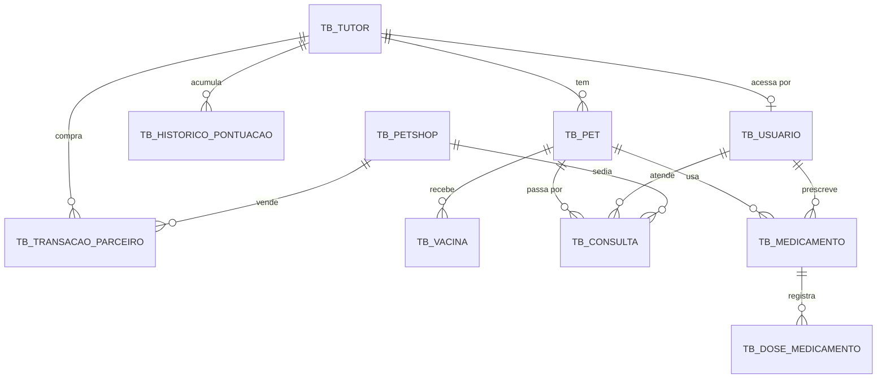

# 🗄️ Banco de dados do Animed

Referência do schema para quem vai construir sobre ele — a **API .NET**, a disciplina de **Database** e qualquer integração futura.

O schema é criado pelo **Flyway** quando a API Java sobe, a partir de `src/main/resources/db/migration/`. O arquivo **[`schema-completo.sql`](schema-completo.sql)** traz as 12 migrations consolidadas, na ordem, para executar direto no Oracle.

> ⚠️ Os identificadores `CLYVO`, `COMISSAO_CLYVO` e o pacote `br.com.fiap.clyvovet` são **funcionais** e não devem ser renomeados, mesmo com o produto se chamando Animed.

---

## 📐 Modelo



---

## 📋 Tabelas

### `TB_TUTOR` — dono do pet e da pontuação

| Coluna | Tipo | Observação |
|--------|------|------------|
| ID_TUTOR | NUMBER(19) | PK, identity |
| NOME | VARCHAR2(120) | |
| EMAIL | VARCHAR2(150) | único |
| CPF | VARCHAR2(14) | único |
| TELEFONE | VARCHAR2(20) | |
| PONTOS_TOTAIS | NUMBER(10) | define o nível |
| MOEDAS | NUMBER(10) | saldo gastável |
| NIVEL | VARCHAR2(20) | `BASICO`, `CUIDADOR`, `TUTOR_PREMIUM` |
| PLANO | VARCHAR2(20) | `GRATUITO`, `INTERMEDIARIO`, `PREMIUM` |
| ATIVO | **NUMBER(1)** | 0 ou 1 — ver a nota sobre booleanos |
| DATA_CADASTRO | TIMESTAMP | |

### `TB_USUARIO` — credencial de acesso

| Coluna | Tipo | Observação |
|--------|------|------------|
| ID_USUARIO | NUMBER(19) | PK, identity |
| NOME | VARCHAR2(120) | |
| EMAIL | VARCHAR2(150) | único, é o login |
| SENHA | VARCHAR2(100) | hash BCrypt, nunca texto puro |
| ROLE | VARCHAR2(20) | `TUTOR` ou `DOUTOR` |
| ID_TUTOR | NUMBER(19) | FK; **nulo quando o perfil é DOUTOR** |
| ATIVO | NUMBER(1) | |
| DATA_CADASTRO | TIMESTAMP | |

### `TB_PET`

| Coluna | Tipo | Observação |
|--------|------|------------|
| ID_PET | NUMBER(19) | PK, identity |
| NOME | VARCHAR2(80) | |
| ESPECIE | VARCHAR2(20) | `CACHORRO`, `GATO`, `AVE`, `ROEDOR`, `REPTIL`, `OUTRO` |
| SEXO | VARCHAR2(10) | `MACHO`, `FEMEA` |
| RACA | VARCHAR2(80) | |
| DATA_NASCIMENTO | DATE | |
| PESO_KG | NUMBER(5,2) | |
| CASTRADO | NUMBER(1) | |
| OBSERVACOES_SAUDE | VARCHAR2(500) | |
| DATA_ULTIMA_PESAGEM | DATE | trava de pontuação: 7 dias |
| ID_TUTOR | NUMBER(19) | FK, obrigatório |

### `TB_VACINA`

| Coluna | Tipo | Observação |
|--------|------|------------|
| ID_VACINA | NUMBER(19) | PK, identity |
| NOME_VACINA | VARCHAR2(120) | |
| DATA_APLICACAO | DATE | obrigatório |
| DATA_PROXIMA_DOSE | DATE | reforço previsto |
| VETERINARIO_RESPONSAVEL | VARCHAR2(120) | |
| LOTE | VARCHAR2(50) | |
| ID_PET | NUMBER(19) | FK, obrigatório |

### `TB_CONSULTA` — atendimento marcado ou realizado

| Coluna | Tipo | Observação |
|--------|------|------------|
| ID_CONSULTA | NUMBER(19) | PK, identity |
| DATA_HORA | TIMESTAMP | obrigatório |
| MOTIVO | VARCHAR2(250) | obrigatório |
| DIAGNOSTICO | VARCHAR2(1000) | preenchido ao concluir |
| PRESCRICAO | VARCHAR2(1000) | conduta, em texto |
| ORIENTACAO | VARCHAR2(500) | instrução do veterinário ao tutor |
| VALOR | NUMBER(10,2) | |
| STATUS | VARCHAR2(20) | `AGENDADA`, `REALIZADA`, `CANCELADA`, `NAO_COMPARECEU` |
| VETERINARIO | VARCHAR2(120) | nome, mantido por histórico |
| ID_VETERINARIO | NUMBER(19) | FK para `TB_USUARIO` |
| ID_PET | NUMBER(19) | FK, obrigatório |
| ID_PETSHOP | NUMBER(19) | FK, opcional |

### `TB_MEDICAMENTO` — prescrição

| Coluna | Tipo | Observação |
|--------|------|------------|
| ID_MEDICAMENTO | NUMBER(19) | PK, identity |
| NOME | VARCHAR2(120) | obrigatório |
| DOSAGEM | VARCHAR2(60) | "1 comprimido", "5 ml" |
| INTERVALO_HORAS | NUMBER(5) | > 0; 2160 = a cada 3 meses |
| DATA_INICIO | DATE | obrigatório |
| DATA_FIM | DATE | nulo = uso contínuo |
| OBSERVACAO | VARCHAR2(250) | orientação ao tutor |
| DATA_CONFIRMACAO_FIM | TIMESTAMP | quando o tutor arquivou |
| ID_PET | NUMBER(19) | FK, obrigatório |
| ID_VETERINARIO | NUMBER(19) | FK para `TB_USUARIO` |

### `TB_DOSE_MEDICAMENTO` — dose efetivamente dada

| Coluna | Tipo | Observação |
|--------|------|------------|
| ID_DOSE | NUMBER(19) | PK, identity |
| DATA_HORA | TIMESTAMP | quando foi dada |
| OBSERVACAO | VARCHAR2(250) | |
| ID_MEDICAMENTO | NUMBER(19) | FK, obrigatório |

### `TB_PETSHOP` — parceiro B2B

| Coluna | Tipo | Observação |
|--------|------|------------|
| ID_PETSHOP | NUMBER(19) | PK, identity |
| RAZAO_SOCIAL | VARCHAR2(150) | |
| NOME_FANTASIA | VARCHAR2(120) | |
| CNPJ | VARCHAR2(18) | único |
| ENDERECO, CIDADE, UF, TELEFONE | VARCHAR2 | |
| TAXA_MENSAL | NUMBER(10,2) | receita fixa |
| COMISSAO_PERCENTUAL | NUMBER(5,2) | receita variável |
| ATIVO | NUMBER(1) | |
| DATA_PARCERIA | TIMESTAMP | |

### `TB_TRANSACAO_PARCEIRO` — compra

| Coluna | Tipo | Observação |
|--------|------|------------|
| ID_TRANSACAO | NUMBER(19) | PK, identity |
| DATA_HORA | TIMESTAMP | |
| VALOR_BRUTO | NUMBER(10,2) | preço de tabela |
| DESCONTO_APLICADO | NUMBER(10,2) | pelo nível do tutor |
| MOEDAS_USADAS | NUMBER(10) | quantidade gasta |
| ABATIMENTO_MOEDAS | NUMBER(10,2) | em reais (0,10 por moeda) |
| VALOR_FINAL | NUMBER(10,2) | bruto − desconto − abatimento |
| COMISSAO_CLYVO | NUMBER(10,2) | sobre o valor final |
| PONTOS_GERADOS | NUMBER(10) | 1 ponto a cada R$ 10 |
| DESCRICAO_PRODUTO | VARCHAR2(250) | |
| ID_TUTOR, ID_PETSHOP | NUMBER(19) | FKs obrigatórias |

### `TB_HISTORICO_PONTUACAO` — extrato

| Coluna | Tipo | Observação |
|--------|------|------------|
| ID_HISTORICO | NUMBER(19) | PK, identity |
| TIPO_ACAO | VARCHAR2(40) | ver lista abaixo |
| PONTOS_GANHOS | NUMBER(10) | **negativo em estornos** |
| DESCRICAO | VARCHAR2(250) | |
| DATA_HORA | TIMESTAMP | |
| ID_TUTOR | NUMBER(19) | FK, obrigatório |

---

## 🔤 Valores de `TIPO_ACAO`

`CADASTRO_PET` · `PERFIL_COMPLETO` · `FOTO_PET` · `REGISTRO_VACINA` · `REGISTRO_CONSULTA` · `REGISTRO_MEDICACAO` · `ATUALIZACAO_PESO` · `CHECKUP_REALIZADO` · `VERMIFUGACAO` · `AGENDAMENTO_CONSULTA` · `COMPRA_PARCEIRO` · `CHECKIN_ESTABELECIMENTO` · `BONUS_SEMANAL` · `MISSAO_CONCLUIDA`

---

## ⚠️ Duas armadilhas que já custaram tempo

### 1. Booleanos são `NUMBER(1)`

Oracle não tem tipo booleano. Todas as colunas `ATIVO` e `CASTRADO` são `NUMBER(1)` com `CHECK (coluna IN (0,1))`.

No Java isso exige `@Convert(converter = NumericBooleanConverter.class)` — sem ele, o Hibernate gera `WHERE ativo = true` e o banco recusa a comparação. **No EF Core, o equivalente é mapear com conversão de valor:**

```csharp
modelBuilder.Entity<Tutor>()
    .Property(t => t.Ativo)
    .HasConversion<int>()        // grava 0/1
    .HasColumnType("NUMBER(1)");
```

### 2. Decimais precisam de `decimal`, nunca `double`

Peso, valores e comissão têm escala definida (`NUMBER(10,2)`, `NUMBER(5,2)`). Em Java é `BigDecimal`; **em C# é `decimal`** — `double` perde centavos e o Hibernate/EF reclama da escala.

```csharp
.Property(t => t.ValorFinal).HasColumnType("NUMBER(10,2)");
```

---

## ▶️ Como executar no Oracle

```sql
-- no SQL Developer ou SQLcl, conectado ao schema da FIAP
@docs/schema-completo.sql
```

O script cria as 10 tabelas, as constraints, os índices e insere os dados iniciais (`V2__seed_data.sql`: tutores, pets, vacinas, consultas e pet shops de exemplo).

Para recomeçar do zero, descomente o bloco de limpeza no fim do arquivo — ele apaga na ordem inversa das dependências.

### Usuários de acesso

`TB_USUARIO` **não** é populado pelo script: as contas de demonstração são criadas pela API ao subir, com hash BCrypt gerado em tempo de execução (`SeedUsuariosConfig`), para que nenhum hash fique versionado no repositório.

| Perfil | E-mail | Senha |
|--------|--------|-------|
| Tutor | `tutor@animed.com.br` | `animed123` |
| Veterinária | `doutor@animed.com.br` | `animed123` |

Se a API .NET for criar usuários por conta própria, use **BCrypt** para manter compatibilidade — as duas APIs leem a mesma tabela.

---

## 🔗 Para a API .NET

O domínio já está validado e testado no lado Java. Para não divergir:

| Regra | Onde está implementada (Java) |
|-------|-------------------------------|
| Faixas de nível e desconto | `enums/NivelGamificacao.java` |
| Pontos por ação | `enums/TipoAcaoPontuacao.java` |
| Crédito, estorno e nível | `service/GamificacaoService.java` |
| Desconto, moedas e comissão | `service/TransacaoParceiroService.java` |
| Horários livres e agendamento | `service/AgendaService.java` |
| Intervalo entre doses | `service/MedicamentoService.java` |

As faixas praticadas hoje:

| Nível | Pontos | Desconto |
|-------|--------|---------:|
| BASICO | 0 – 299 | 0% |
| CUIDADOR | 300 – 1.199 | 10% |
| TUTOR_PREMIUM | 1.200+ | 15% |
