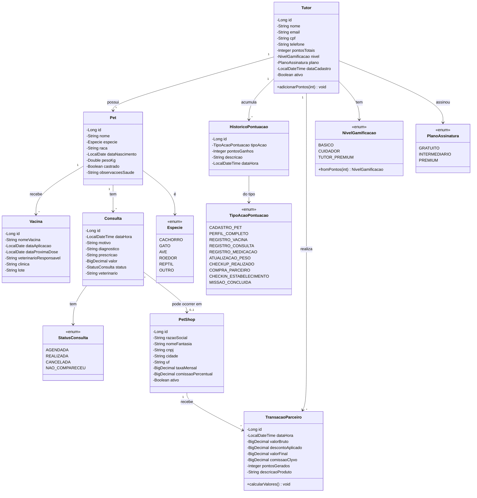

# 📐 Diagrama de Classes - Clyvo VET

## Diagrama UML (Mermaid)

## Cardinalidades resumidas

| Relacionamento | Tipo | Detalhe |
|----------------|------|---------|
| Tutor ↔ Pet | 1:N | Um tutor tem vários pets |
| Tutor ↔ HistoricoPontuacao | 1:N | Audit trail das ações |
| Tutor ↔ TransacaoParceiro | 1:N | Histórico de compras |
| Pet ↔ Vacina | 1:N | Histórico vacinal |
| Pet ↔ Consulta | 1:N | Agenda + histórico clínico |
| PetShop ↔ TransacaoParceiro | 1:N | Vendas do parceiro |
| Consulta ↔ PetShop | N:0..1 | Opcional (consulta pode ser em outro local) |

## Coerência DER ↔ Classes

Cada **entidade JPA** corresponde a uma **tabela no Oracle**:

| Classe Java | Tabela Oracle | PK |
|-------------|---------------|-----|
| `Tutor` | `TB_TUTOR` | `ID_TUTOR` |
| `Pet` | `TB_PET` | `ID_PET` |
| `Vacina` | `TB_VACINA` | `ID_VACINA` |
| `Consulta` | `TB_CONSULTA` | `ID_CONSULTA` |
| `PetShop` | `TB_PETSHOP` | `ID_PETSHOP` |
| `TransacaoParceiro` | `TB_TRANSACAO_PARCEIRO` | `ID_TRANSACAO` |
| `HistoricoPontuacao` | `TB_HISTORICO_PONTUACAO` | `ID_HISTORICO` |

### Constraints implementadas

- **PK** em todas as tabelas (`GENERATED ALWAYS AS IDENTITY`)
- **FK** em todos os relacionamentos (com nome explícito via `@ForeignKey`)
- **UNIQUE** em campos críticos: `Tutor.email`, `Tutor.cpf`, `PetShop.cnpj`
- **CHECK** em enums (`NIVEL`, `PLANO`, `ESPECIE`, `STATUS`)
- **NOT NULL** em campos obrigatórios
- **DEFAULT** em campos com valor inicial (`PONTOS_TOTAIS=0`, `ATIVO=1`)

## Normalização

O modelo está na **3ª Forma Normal (3FN)**:

- ✅ Todos os atributos são atômicos (1FN)
- ✅ Não há dependências parciais — toda PK é simples (2FN)
- ✅ Não há dependências transitivas — nível é derivado de pontosTotais via código, não armazenado redundantemente
